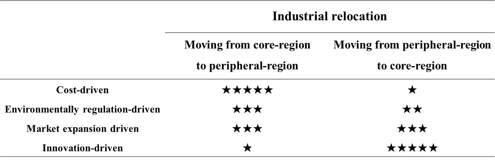
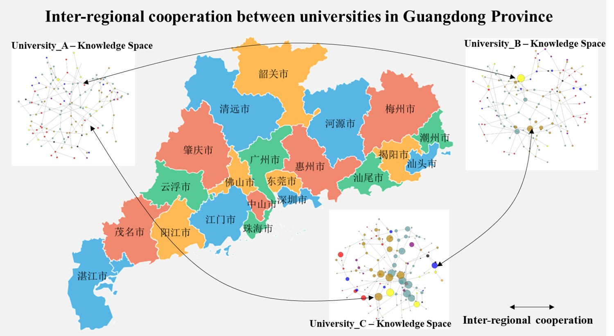

# YIJIA.github.io

# Economic Geographer, Data Scientist

#### Research interests: evolutionary economic geography, geography of innovation, cryptocurrency, data science
#### Technical Skills: Python, Stata
#### [Google Scholar](https://scholar.google.com/citations?user=yJg1axYAAAAJ&hl=en&oi=sra )

## Education
- Ph.D., Economic Geography, Kiel University, Germany (_July 2021_)								       		
- M.S., Regional Economics, Sun Yat-sen University, China (_July 2012_)	 			        		
- B.S., Ecology, South China Agriculture University, China (_July 2009_)

## Work Experience
- Assistant professor @ School of Economics and Management, Dongguan University of Technology, China (_March 2023 - Present_)							       		
- Research associate @ Guangzhou Institute of Geography, Guangdong Academy of Science, China (_December 2021 - March 2023_)			        		
- Senior Consultant @ Consulting Department, DTZ Cushman & Wakefield, China (_September 2012 - December 2016_)

## Teaching
- Statistics - Spring 2024
- International Trade Geography - Fall 2023
- Industrial Economics - Fall 2023 
- Securities Investment and Practice  - Fall 2023
- Bachelor thesis supervision (10 students)
- Master thesis supervision (1 student)

## Publications

#### 2025
- **_Chen Y^_**, & Wu, K. (2025). Integrating artificial intelligence into regional technological domains: the role of intra-and extra-regional AI relatedness. **_Cambridge Journal of Regions, Economy and Society_**, rsae041. [Link](https://kns.cnki.net/kcms2/article/abstract?v=9hl5eXOdJcbpR7hDMqaZT7qWPtCXgbHpuUIQ2V5euT1wnQPik_JtM-JL-IuDtKY6GRHBrQvdmeKWc0ZzeXe3latrD0avFx4ak75rM7HXGVIc95GdLIfq-BTFtcuVUCfGhdNaBRWOXtN-hplLcXo2XQ==&uniplatform=NZKPT&language=CHS](https://academic.oup.com/cjres/advance-article-abstract/doi/10.1093/cjres/rsae041/7950699?redirectedFrom=fulltext)

#### 2024
- Ye Y, **_Chen Y^_**, Liu X, Xu J. (2024).Beyond the perspective of technology: Theoretical basis and scientific issues of new infrastructure to promote the high-quality development of regional economy. **_Scientia Geographica Sinica (地理科学)_**, 44(4): 553-561. (In Chinese)  [Link](https://kns.cnki.net/kcms2/article/abstract?v=9hl5eXOdJcbpR7hDMqaZT7qWPtCXgbHpuUIQ2V5euT1wnQPik_JtM-JL-IuDtKY6GRHBrQvdmeKWc0ZzeXe3latrD0avFx4ak75rM7HXGVIc95GdLIfq-BTFtcuVUCfGhdNaBRWOXtN-hplLcXo2XQ==&uniplatform=NZKPT&language=CHS)

#### 2023
- Wu K,**_Chen Y^_**, Zhang H, Liu Y, Wang M, Ye Y, Gong W. (2023). ICTs capability and strategic emerging technologies: Evidence from Pearl River Delta. **_Applied Geography_**, 157(8), 103019. [Link](https://www.sciencedirect.com/science/article/abs/pii/S0143622823001509)
- Xu J, Zhang H^, **_Chen Y_**, Du Z, Ye Y. (2023). The sequence of theoretical development and research agendas of evolutionary economic geography. **_Geographical Research (地理研究)_**, 2023, 42(9): 2433-2450. (In Chinese) [Link](https://www.dlyj.ac.cn/CN/abstract/abstract54803.shtml)

#### 2022
- **_Chen Y^_**. (2022). Rethinking asset modification in regional industrial path development: toward a conceptual framework. **_Regional Studies_**, 56(2), 338-350. [Link](https://www.tandfonline.com/doi/full/10.1080/00343404.2021.1941839)
- **_Chen Y_**, Hassink, R^. (2022). The geography of the emergence of online peer-to-peer lending platforms in China: an evolutionary economic geography perspective. **_International Journal of Urban Sciences_**, 26(2), 351-371.[Link](https://www.tandfonline.com/doi/abs/10.1080/12265934.2021.1879664#:~:text=We%20find%20that%20China's%20P2P,P2P%20industry%20could%20build%20on.)
- **_Chen Y_**, Tan T^. (2022). A review of regional innovation polity in European economic geography. **_World Regional Studies (世界地理研究)_**, 31(02), 259-269. (In Chinese) [Link](https://sjdlyj.ecnu.edu.cn/CN/10.3969/j.issn.1004-9479.2022.02.2020249)
- Dai D, **_Chen Y^_**. (2022) The geography of the fintech industry in China: An analysis of China’s city-level patenting. **_Growth and Change_**, 53(4), 1907-1932.[Link](https://onlinelibrary.wiley.com/doi/abs/10.1111/grow.12630)
- Wu K, Zhang H, Ye Y^,**_Chen Y_**, Yue X. (2022). Measurement and evolution characteristics of collaborative innovation in the Guangdong-Hong Kong-Macao Great Bay Area. **_Progress in Geography (地理科学进展)_**, 41(09), 1662-1676. (In Chinese) [Link](https://www.progressingeography.com/CN/10.18306/dlkxjz.2022.09.009)

#### 2020
- **_Chen Y_**, Hassink R^ (2020). Multi-scalar knowledge bases for new regional industrial path development: toward a typology. **_European Planning Studies_**, 28(12), 2489-2507. [Link](https://www.tandfonline.com/doi/full/10.1080/09654313.2020.1724265)

#### 2018
- **_Chen Y^_**. (2018). Smart specialization and its implications for characteristic towns in China. **_Development of Small Cities & Towns (小城镇建设)_**, (05), 25-31. (In Chinese) [Link](https://www.cnki.net/KCMS/detail/detail.aspx?dbcode=CJFD&dbname=CJFDLAST2018&filename=XCJS201805006&uniplatform=OVERSEA&v=AzzOUiHzMpfFXxUh73kZw28AGTHvc1NhcKKpH0dt5v1fjfj4hmaTQ2o92ETQElDh)

## Projects
###  From the peripheral regions to the core regions and vice versa? A new model for industrial relocation in Guangdong Province (GD24CYJ37, funded by the Guangdong Planning Office of Philosophy and Social Science)
- Guangdong is the largest economic province in China, but the uneven regional development within Guangdong has always been one of the biggest challenges for the province. By the end of 2020, the 9 cities in the Pearl River Delta have accounted for 80% of the province's GDP with 30% of the area and 60% of the population, while the 12 cities outside the Pearl River Delta accounted for less than 20% of the province's GDP with 70% of the area and 40% of the population.
- In contrast to the traditional model of industrial relocation, where enterprises and industries are relocated from core regions to peripheral regions, we find that there are two types of industrial relationships at the same time, namely, relocation from core regions to peripheral regions and relocation from peripheral regions to core regions.
- This project aims to examine the mechanism of the two types of industrial relocation and whether and how they mitigate the uneven regional development in Guangdong.

###  Mitigating the uneven development of higher education in Guangdong Province: the role of inter-regional cooperation (2023GXJK135, funded by the Education Department of Guangdong Province)
- Higher education in Guangdong Province is geographically unevenly distributed. By the end of 2020, there were about 150 universities in Guangdong Province, ranking second among provinces in China. However, the universities in the Pearl River Delta account for more than 80% of the total number in the province, including all the well-known universities, while the peripheral cities in Guangdong province only account for less than 20%. 
- In order to counteract the uneven regional development of higher education, this project aims to investigate whether and how inter-regional cooperation between universities can mitigate the uneven development of higher education in Guangdong Province.

